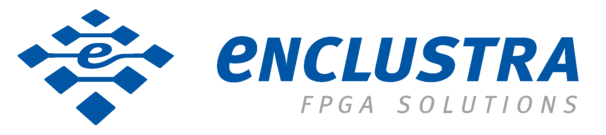

# Secure Boot reference design for Zynq Ultrascale+ MPSoC

The group High Performance Multimedia from the Institute of Embedded Systems associated with ZHAW School of Engineering proudly presents a secure boot implementation for the SoC module Mercury XU5 from Enclustra based on the Zynq Ultrascale+ MPSoC from Xilinx. This reference design was created during a bachelor thesis and afterwards released on github. The repository was forked and further updated by Enclustra, to keep the reference design up to date.

> For recent news about the High Performace group at ZHAW, check out our [Blog](https://blog.zhaw.ch/high-performance/).

This reference design for the Mercury PE1 board with the SoC Module Mercury XU5
was created during a bachelor thesis. It provides a reference implementation
and instructions on how to create a secure and boot able image for your device,
as well as other security features provided with the Xilinx Ultrascale+ MPSoC.

The complete documentation of the bachelor thesis can
be found in the [here](BA20_rosn_02_Secure_Boot_final.pdf).

## Repository structure

| Folder/File name                    | Description                                                                                                                                 |
| ----------------------------------- | ------------------------------------------------------------------------------------------------------------------------------------------- |
| crypto-api                          | Contains the description and according examples to work with the Linux Crypto API.                                                          |
| petalinux-prj                       | Contains a PetaLinux project and the description to generate an encrypted and authenticated boot image.                                     |
| program-efuse-bbram                 | Contains the description how to program the eFuse and BBRAM.                                                                                |
| tamper-monitoring                   | Contains the description how to implement the tamper monitoring unit. Additionally, it contains also files used for testing.                |
| trustzone                           | Contains the description for TrustZone implementation. How to implement OP-TEE on the zcu102 Evaluation Kit from Xilinx is also described.  |
| update-process                      | Contains a description how an update procedure may look like.                                                                               |
| BA20_rosn_02_Secure_Boot_final.pdf  | Final bachelor thesis documentation.                                                                                                        |

## Secure Boot

The [petalinux-prj](petalinux-prj) directory contains a PetaLinux project,
which can be built with just a few steps. Start here if you want to build your
own secure image. Later you can expand the project with various other features.

## Tamper Monitoring

The [tamper-monitoring](tamper-monitoring) directory describes how to implement
the tamper monitoring unit on the Zynq Ultrascale+. It describes three
different ways to configure the tamper and system monitoring unit.
Additionally, some files are provided to test the implementation.

## Programming the eFuse and BBRAM

The eFuse and BBRAM are the secure storage in the Zynq Ultrascale+. The BBRAM is
a battery backed storage, which is non-permanent. It can contain the AES device
key. The eFuse is a permanent register, where important security settings are
stored. Beside, it can also contain the AES device key as well as the RSA key
hash for verification. The [program-efuse-bbram](program-efuse-bbram) directory
contains a small description and links to tutorials from Xilinx.

## Update Process

Updating firmware and software is crucial to maintain security during the
life-cycle of a device. In the [update-process](udate-process) directory, some
advises are given on how to implement an update procedure.

## Crypto API

The Zynq Ultrascale+ has cryptography hardware for different algorithms with key
handling integrated in the hardware. The directory [crypto-api](crypto-api)
describes how the hardware of the Zynq Ultrascale+ can be used in Linux with the
Crypto API.

## TrustZone

The Zynq Ultrascale+ supports ARM TrustZone. The directory
[trustzone](trustzone) describes the concept and shows the implementation of
OP-TEE a secure OS.

## Tools and Environment

This section describes the tools and the environment used for the
implementation. All features were tested on a Mercury XU5 (ME-XU5-5EV-2I-D12E)
module mounted on a Mercury PE1 board (ME-PE1-300-W). The  examples
were tested with Enclustras Reference Design and Petalinux Images for Xilinx tool version
2020.1. But the examples are likely to work with future Reference Design and Petalinux
releases as well. Most applications were manually compiled, although they can be directly
integrated into the PetaLinux process. The gnu-aarch64-none-linux-gcc compiler (9.2-2019.12) was used
to manually compile the applications. The operating system of the host computer
was based on Ubuntu 18.04.
